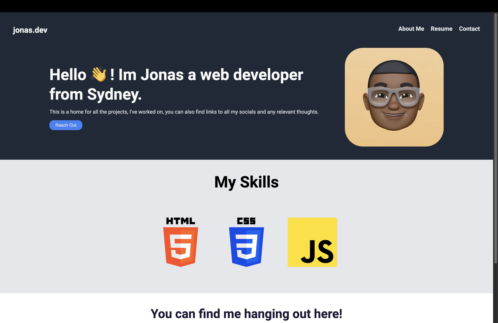

# Landing Page Project

This is the **Landing Page Project** created as part of [The Odin Project's](https://www.theodinproject.com) curriculum. The project demonstrates the use of **HTML** and **CSS** to create a responsive and visually appealing webpage.

---

## 🛠️ **Technologies Used**
- **HTML5**
- **CSS3**
- **Flexbox** for layout management
- Responsive design techniques

---

## 🎯 **Project Objectives**
1. Learn to structure a webpage with semantic HTML.
2. Practice using CSS for layout and styling.
3. Apply **Flexbox** for responsive and flexible design.
4. Build a static webpage similar to modern landing pages.

---

## ✨ **Key Features**
- **Responsive Design:** Adjusts seamlessly to different screen sizes.
- **Clean Layout:** Uses Flexbox for organization and alignment.
- **Modern Aesthetic:** Focus on typography, spacing, and visuals for an elegant user interface.

---

## 🚀 **Live Demo**
Check out the live version of the project here: [Landing Page Demo](nkululekojonas.github.io/landing-page)  
---

## 📸 **Preview**
  
---

## 🔧 **Installation & Usage**
1. Clone this repository:  
   ```bash
      git clone https://github.com/your-username/landing-page-project.git
